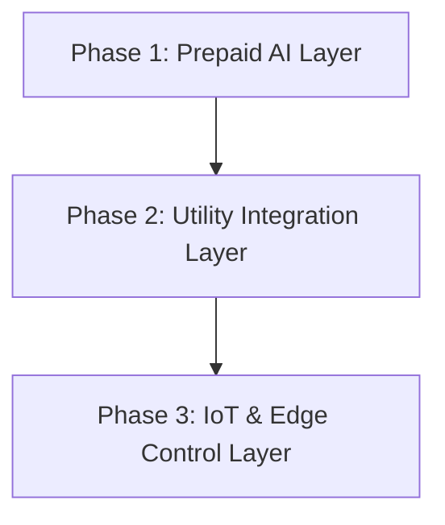
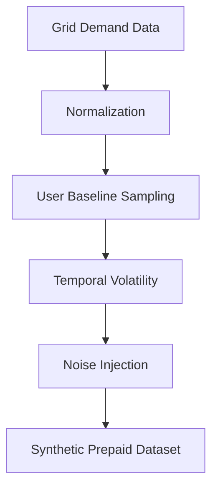

# ⚡ Smart Energy Management System (SEMS)
## 🌍 Phased AI-Driven Energy Intelligence for Data-Sparse Power Systems

> **Research-Backed | Deployment-Oriented | Sustainability-Focused AI System**  
> 🎓 Graduate Research Project – M.Tech (Artificial Intelligence & Machine Learning)  
> ♻️ Aligned with UN SDG-7: Affordable & Clean Energy  

---

## 📌 1. Introduction & Context

Energy systems across the Global South, particularly in **Sub-Saharan Africa**, face a paradox:
- Energy demand is increasing rapidly
- Infrastructure modernization lags behind
- Smart meters and IoT devices are not universally deployed
- Most households rely on **prepaid electricity meters**

Conventional “smart grid” solutions assume **dense, real-time telemetry**, making them unsuitable for these environments.

The **Smart Energy Management System (SEMS)** is designed specifically for such **data-sparse, infrastructure-constrained contexts**, offering an AI-driven pathway from **basic prepaid analytics** to **fully autonomous energy optimization**.

This repository implements **Phase 1** of SEMS as a working system while grounding its design in a broader **three-phase research architecture**.

---

## 🎯 2. Research Problem Statement

The core research question addressed is:

> *How can machine learning be used to deliver actionable energy intelligence in environments where high-frequency consumption data and smart infrastructure are unavailable?*

### Key Constraints Addressed
- Lack of household-level time-series data  
- Prepaid-only consumption visibility  
- Privacy and regulatory limitations  
- Heterogeneous user behavior  

SEMS reframes these constraints as **design parameters**, not limitations.

---

## 🧠 3. Phased System Architecture (Primary Contribution)



### Phase 1 – Prepaid AI Layer (Implemented)
- Requires **no smart meters**
- Uses prepaid purchase and consumption patterns
- Provides:
  - Consumption forecasting
  - Credit depletion timelines
  - Budget planning support

### Phase 2 – Utility Integration Layer (Proposed)
- Integrates smart meter APIs where available
- Enables:
  - Real-time grid forecasting
  - Loss and anomaly detection
  - Regional energy benchmarking

### Phase 3 – IoT & Autonomous Control (Proposed)
- Appliance-level telemetry
- Automated demand response
- Federated learning to preserve privacy

---

## 🔁 4. Phase 1 Internal ML Pipeline


This pipeline ensures **robust prediction under uncertainty**, a defining characteristic of prepaid systems.

---

## 🧪 5. Data Strategy & Synthetic Data Generation

### 5.1 Utility-Level Data
- Eskom residual demand dataset
- 43,824 hourly observations
- Captures national load dynamics

### 5.2 Synthetic Consumer Modeling
Due to the unavailability of real prepaid household data, SEMS introduces a **stochastic data synthesis framework**:

\[
U_{i,t} = \alpha_i \cdot D_t \cdot \beta_t \cdot \gamma_i
\]

Where:
- \( \alpha_i \): baseline user consumption
- \( D_t \): normalized grid demand
- \( \beta_t \): temporal volatility
- \( \gamma_i \): user-specific noise



This approach preserves **statistical realism** while ensuring **privacy and scalability**.

---

## ⚙️ 6. Machine Learning Methodology

### 6.1 Model Selection: LightGBM
LightGBM was selected due to:
- Superior performance on tabular energy data
- Ability to model non-linear demand patterns
- Fast training and low inference latency
- Built-in feature importance for interpretability

### 6.2 Feature Engineering
- Lagged consumption features (1, 24, 168)
- Rolling averages (3, 24, 168)
- Temporal encodings (hour, weekday, month)
- Behavioral indicators (weekend vs weekday)

---

## 📊 7. Model Evaluation & Results

| Forecast Level | MAE | RMSE | R² |
|---------------|-----|------|----|
Grid-Level | 217 MW | 342 MW | 0.9885 |
Consumer-Level | 189 kWh | 258 kWh | 0.9940 |

Results demonstrate that **classical gradient boosting models** can achieve near state-of-the-art performance even in data-sparse environments.

---

## 🚀 8. Deployment Architecture

```mermaid
flowchart LR
    A[Trained Models (.joblib)] --> B[FastAPI Backend]
    B --> C[REST APIs]
    C --> D[Web / Mobile Interfaces]
    C --> E[Utility Dashboards]
```

The system is designed for **cloud-native deployment**, with minimal infrastructure requirements.

---

## 📁 9. Repository Structure

```text
Smart-Energy-Management-System/
├── notebooks/
├── data/
├── models/
├── api/
├── docs/
├── requirements.txt
├── .gitignore
└── README.md
```

---

## 🌍 10. Societal & Sustainability Impact

- Supports energy access planning
- Reduces energy poverty through better budgeting
- Improves utility forecasting accuracy
- Aligns with sustainable development goals

---

## 🔮 11. Future Research Directions

- Integration with live prepaid systems
- IoT-enabled demand response
- Federated learning across communities
- Explainability via SHAP and counterfactuals
- Carbon-aware load optimization

---

## 👤 12. Author

**Kupakwashe T. Mapuranga**  
M.Tech – Artificial Intelligence & Machine Learning  
Symbiosis Institute of Technology

Research Interests:
- Sustainable AI Systems  
- Energy Informatics  
- Data-Sparse Machine Learning  
- Edge & Federated AI  

---

## 📜 13. Citation

If you reference this work:

Mapuranga, K. T. (2026). *Phased AI-Driven Energy Management: From Data-Sparse Forecasting to IoT-Enabled Control in Sub-Saharan Africa.*
