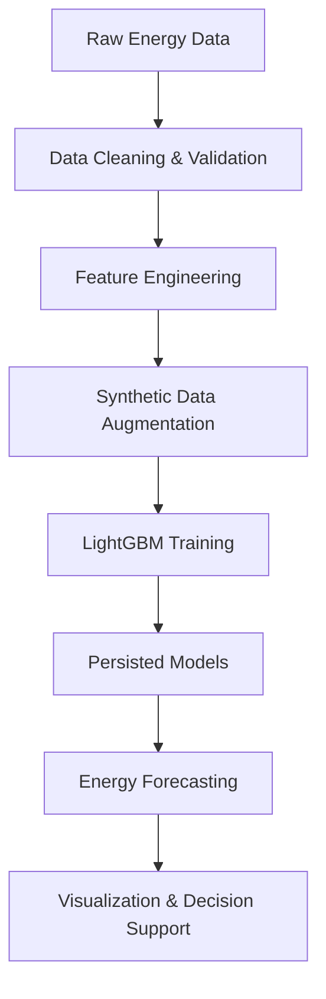

# Smart Energy Management System (SEMS)
## Predictive Energy Analytics using Machine Learning

---

## Executive Summary

The **Smart Energy Management System (SEMS)** is an applied machine learning system designed to **model, predict, and analyze energy consumption patterns** using structured historical data.

Rather than treating energy forecasting as a narrow regression exercise, this project is engineered as a **decision-support system** for sustainable energy planning. It integrates **data engineering, synthetic data augmentation, gradient-boosted learning (LightGBM), and interpretability-driven analysis** to reflect real-world energy-sector constraints.

The system prioritizes **robustness, transparency, and deployability**, making it suitable for utility-scale analytics, smart energy systems, and sustainability-driven policy environments.

---

## 1. Problem Context

Energy systems increasingly face:

- Rapid growth in consumption demand  
- Limited generation and transmission capacity  
- Inefficient end-user behavior  
- Reactive, rule-based planning mechanisms  

Traditional energy forecasting relies on historical averages and static heuristics, which fail to capture:

- Non-linear demand dynamics  
- Temporal consumption variability  
- User-level heterogeneity  

This results in poor predictive performance and limited support for proactive energy planning.

SEMS addresses this gap by introducing **predictive intelligence** through supervised machine learning.

---

## 2. Project Objective

The objective of SEMS is not simply to predict energy values, but to construct a pipeline that:

- Converts raw energy records into meaningful predictive features  
- Generalizes under limited, noisy, or incomplete data  
- Preserves interpretability for operational and regulatory trust  
- Can evolve into real-time or policy-aware energy systems  

This design philosophy mirrors production energy analytics rather than academic benchmarks.

---

## 3. End-to-End Pipeline

### Conceptual Pipeline

```
Raw Energy Consumption Data
        ↓
Data Cleaning & Validation
        ↓
Feature Engineering & Normalization
        ↓
Synthetic Data Augmentation
        ↓
LightGBM Model Training
        ↓
Model Persistence (joblib)
        ↓
Prediction, Analysis & Visualization
```

### Pipeline Diagram



---

## 4. Data Engineering Strategy

### Data Characteristics
- Historical energy consumption records  
- User-level and grid-level attributes  
- Temporal and load-related features  

### Preprocessing Steps
- Missing value handling  
- Feature scaling and normalization  
- Outlier management  
- Synthetic data generation  
- Temporal train–test splitting  

Synthetic data augmentation mitigates **data sparsity**, a common limitation in energy datasets.

---

## 5. Machine Learning Methodology

### Model Selection: LightGBM (LGBM)

LightGBM was selected due to:

- Strong performance on structured data  
- Efficient non-linear interaction modeling  
- Low computational overhead  
- Fast convergence  
- High interpretability  

These properties align with energy-sector requirements where **trust and explainability are essential**.

### Training Strategy
- Separate models for grid-level and user-level prediction  
- Iterative experimentation in notebooks  
- Empirical hyperparameter tuning  
- Model persistence using `joblib`  

---

## 6. Visualization & Insight

The project includes visualization-enabled notebooks providing:

- Consumption trend analysis  
- Prediction vs actual comparison  
- Feature importance interpretation  
- Performance diagnostics  

These support **human-in-the-loop decision-making**.

---

## 7. Repository Structure

```
SEMS/
│
├── notebooks/
├── joblib_models/
├── Data/
├── Docs/
└── README.md
```

---

## 8. Running the Project

```bash
pip install lightgbm pandas numpy matplotlib scikit-learn joblib
jupyter notebook
```

---

## 9. Practical Applications

- Smart grids  
- Residential and industrial energy monitoring  
- Load forecasting and peak demand management  
- Sustainability and carbon-reduction planning  
- Policy-driven energy analytics  

---

## 10. Engineering Contribution

This project demonstrates that:

- Classical ML remains highly effective for energy forecasting  
- Synthetic data improves robustness  
- Explainability is critical for adoption  
- Engineering discipline outperforms model hype  

---

## 11. Future Enhancements

- IoT integration  
- Real-time streaming prediction  
- Reinforcement learning for load optimization  
- Carbon footprint estimation  
- Web-based energy dashboards  

---

## Author

**Kupakwashe T. Mapuranga**  
M.Tech – Artificial Intelligence & Machine Learning  

Focus Areas:
- Sustainable AI Systems  
- Energy Informatics  
- Applied Machine Learning for Decision Support
